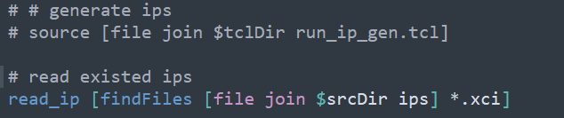
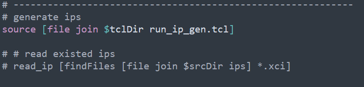

自学使用TCL脚本管理Vivado工程开发的脚本和示例
================
## 来源

[高老师Non-Prj文章(1)](https://mp.weixin.qq.com/s/10E2Rc-anInxabkBx1w41A)

[高老师Non-Prj文章(2)](https://mp.weixin.qq.com/s?__biz=MzI5NTQwODcyMQ==&mid=2247486560&idx=1&sn=1869e26ea719798a8e1d3161e2b0d513&chksm=ec55495edb22c0485f438abac93627cf600bf9de7fb4af6afd43ce1a6f3062be7d994e278e9a&scene=178&cur_album_id=1528076574774886404#rd)

干货满满的高老师微信公众号


## 如何使用
### 目录结构


* 所有源文件存放在<prj_dir>/src文件夹中
	1. 约束文件:<prj_dir>/src/cons
	2. verilog代码存放在<prj_dir>/src/rtl中
	3. ip生成脚本存放在<prj_dir>/src/ip_scripts中
	4. 已经生成好的或者复制于其它地方的ip存放在<prj_dir>/src/ips中，每个文件夹代表一个ip
* 所有工程运行tcl脚本存放在<prj_dir>/Prj_Tcl中
* 一些pdf和参考、笔记存放在<prj_dir>/docs中

### 必须修改的选项
在使用上述默认目录结构时及默认的脚本时，必须根据你自己的FPGA工程修改的参数有

1. 顶层module名：修改`run_set_env.tcl`中的top变量为你的顶层module名 

2. FPGA型号：修改`run_set_env.tcl`中的`device` `package` `speed`

3. verilog header文件：修改`run_set_env.tcl`中的列表变量`HeaderFileSet`，以空格分隔，每个名字是一个Header文件。如果你的源文件中使用了`include`选项，则必须执行这一步，显式地将这些文件的file type设置为verilog header，若没有include文件，`{}`内容直接留空即可

4. ip的生成：
   1. 如果ip已经存在或在其他地方生成完成，直接将其或者`.xci`放入<prj_dir>/src/ips中，并且如图修改代码`run_read_src.tcl`

   

   2. 如果ip要通过脚本生成，那么将生成ip的脚本放入<prj_dir>/src/ip_scripts中，然后如图修改`run_read_src.tcl`

   

   3. 如果是使用ip生成脚本，只需生成一次即可，故按b修改生成完成后，还需要改回a中所示状态

### 使用演示

1. 创建工程文件夹<prj_dir>，复制Prj_Tcl文件夹到<prj_dir>中
2. 打开vivado，在下方Tcl Console中输入 

```tcl
# <prj_dir>是你自己的目录路径
cd <prj_dir>
# 输入pwd确认是否所在目录是否正确
pwd
```


3. （可选）创建文件目录，也可以手动创建，省略这一步

```tcl
source ./Prj_Tcl/run_create_dirs.tcl
```


4. 将verilog源代码放入`<prj_dir>/src/rtl`,约束文件放入`<prj_dir>/src/cons`,ip根据已生成或者使用脚本两种情况，参照[必须修改的选项](#必须修改的选项)中ip的添加方法。

5. 源文件添加完成之后

```tcl
source ./Prj_Tcl/run_set_env.tcl
source ./Prj_Tcl/run_prj.tcl
```
6. 除了工程初始化，其后如果修改了源文件或者需要单独执行综合、布局布线、生成bit，可单独source相应的脚本，脚本功能如名
7. 相关文件路径与工程属性变量设置位于`run_set_env.tcl`中，如果执行tcl命令中出现变量未定义或者文件路径找不到可单独执行

```tcl
source ./Prj_Tcl/run_set_env.tcl
```


## 版本记录

### V0.1 2021-11-20
* 来自高老师的源码

### V0.2 2021-11-20

解决了以下问题

* glob无法递归获取子文件夹中的文件
* read_verilog不能自动识别Verilog Header
* 文件夹需要提前创建，否则综合报dcp写入权限错误
* 对一些功能进行了拆分，创建了不同的tcl脚本
* 撰写了脚本介绍和使用教程
